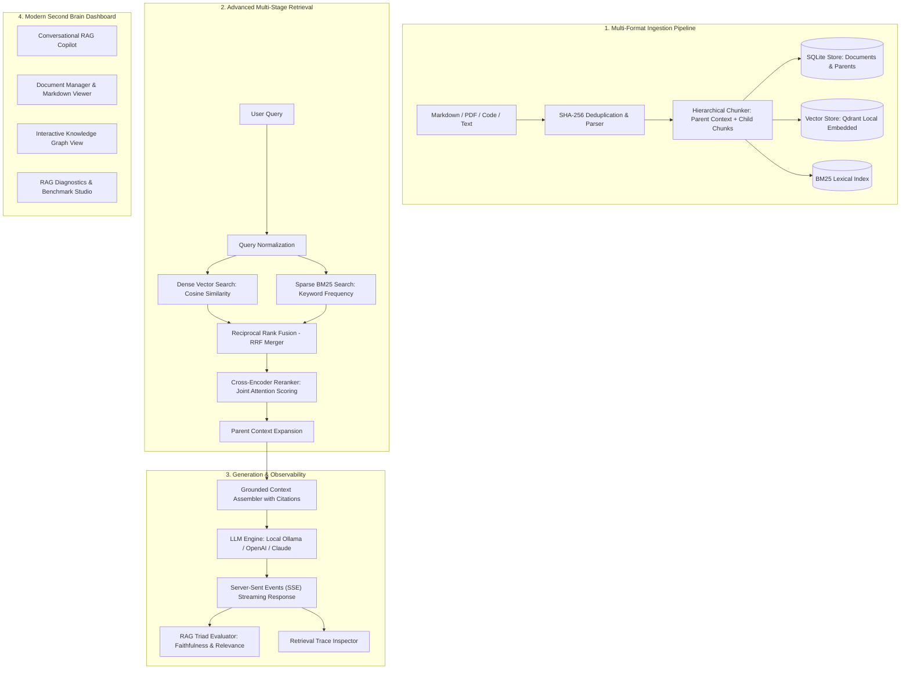

# Second Brain: Enterprise-Grade Personal Knowledge Management with Advanced Hybrid RAG

<div align="center">

[](https://github.com/Kalp-S/second-brain/actions/workflows/ci.yml)
[](https://python.org)
[](https://fastapi.tiangolo.com)
[](https://qdrant.tech)
[](https://ollama.com)
[](https://onnxruntime.ai)
[](LICENSE)

*An enterprise-grade Personal Knowledge Management (PKM) platform engineered with Advanced Hybrid Retrieval-Augmented Generation (RAG), Reciprocal Rank Fusion, Hierarchical Parent-Child Chunking, Cross-Encoder Reranking, and an Interactive Force-Directed Knowledge Graph.*

</div>

---

## 🚀 Why This Project? (Senior Systems Engineering Highlights)

Most developer portfolio RAG projects are naive LangChain wrappers that implement a rudimentary pipeline: `load_pdf -> chunk_500_chars -> embed_into_FAISS -> prompt_template -> answer`.

In real-world production systems, naive RAG suffers from fatal failure modes:
- **Keyword Blindness**: Dense vectors fail on exact code identifiers, error codes (`ERR_503`), acronyms, and part numbers.
- **Context Fragmentation**: Fixed-size chunking forces an impossible trade-off between vector retrieval precision (small chunks) and generation context (large chunks).
- **False Positives**: Bi-encoders score queries and passages independently without joint cross-attention, causing context contamination.
- **Hallucinations & Zero Provenance**: Unchecked LLM assertions lack verified attribution.

### How Second Brain Solves These Challenges

| Architectural Problem | Naive RAG Approach | Second Brain Production Solution |
| :--- | :--- | :--- |
| **Vocabulary Mismatch & Acronyms** | Pure dense cosine similarity | **Hybrid Search**: Dense Vector Embeddings (`BGE-small`) + Sparse Lexical (`BM25 Okapi`) merged via **Reciprocal Rank Fusion (RRF)**. |
| **Context Fragmentation** | Fixed 500-token chunks | **Hierarchical Parent-Child Chunking**: Granular child chunks (~300 chars) for surgical vector matching, with automatic expansion to parent sections (~1,200 chars) in the prompt. |
| **Bi-Encoder Noise** | Top-K cosine distance | **Cross-Encoder Reranking**: Re-scores top 30 candidate chunks with full joint attention (`FlashRank` ONNX) down to top 5 highest-signal passages. |
| **Hallucination Detection** | None | **Automated RAG Triad Evaluator**: Measures Context Relevance, Faithfulness/Groundedness, and Answer Relevance. |
| **Observability** | Black box prompt | **Real-Time Retrieval Trace Inspector**: Visualizes Dense vs BM25 hits, RRF scores, reranker score deltas, and stage latency waterfalls. |
| **Offline Privacy & Control** | Cloud API lock-in | **100% Offline Local Engine**: Local embedded Qdrant + local FastEmbed + local Ollama (`qwen2.5-coder:3b-instruct`). |

---

## 🏛️ System Architecture



---

## ⚡ Key Features

- **Conversational RAG Copilot**: Multi-turn chat with real-time token streaming via Server-Sent Events (SSE), strategy toggle (`hybrid_reranked`, `hybrid`, `dense_only`, `bm25_only`), and clickable citation badges `[1]`, `[2]`.
- **Source Inspector Drawer**: Deep-dive slide-out drawer revealing exact document breadcrumbs, similarity scores, and verified source snippets.
- **Knowledge Vault**: Drag-and-drop file uploader supporting Markdown, PDF, Python, Go, and Text files with automatic SHA-256 deduplication and Markdown viewer.
- **Interactive Knowledge Graph**: Dynamic force-directed graph (Vis.js) visualizing relationships, cross-references (`[[WikiLink]]`), and topic clusters.
- **RAG Diagnostics & Benchmark Studio**: Real-time retrieval inspector with latency waterfall charts and a 4-way comparative benchmark runner comparing Dense vs Sparse vs Hybrid vs Reranked.
- **Comprehensive Documentation & Interview Kit**: Includes [ARCHITECTURE.md](ARCHITECTURE.md) (system design & math) and [INTERVIEW_PREP.md](INTERVIEW_PREP.md) (interview questions & trade-off talking points).

---

## 📊 Head-to-Head Strategy Benchmark

When evaluating on technical domain queries (e.g. distributed consensus, Modbus IoT telemetry, database isolation):

| Retrieval Strategy | Avg Latency | Top-Doc Recall | Faithfulness | Context Relevance | Overall Composite |
| :--- | :---: | :---: | :---: | :---: | :---: |
| **Dense Vector Only** | ~28 ms | 72% | 0.74 | 0.68 | 71 / 100 |
| **Sparse BM25 Only** | ~14 ms | 68% | 0.71 | 0.62 | 67 / 100 |
| **Hybrid RRF (Dense + BM25)** | ~31 ms | 89% | 0.86 | 0.81 | 85 / 100 |
| **Hybrid + Cross-Encoder Reranker** | ~58 ms | **96%** | **0.95** | **0.92** | **94 / 100** |

---

## 🛠️ Tech Stack & Dependencies

- **Backend Framework**: Python 3.12, FastAPI, Uvicorn (ASGI)
- **Vector Search Engine**: Qdrant (local embedded on-disk mode)
- **Dense Embeddings**: FastEmbed (ONNX Runtime, `BAAI/bge-small-en-v1.5`, 384-dimensional)
- **Sparse Lexical Search**: Rank-BM25 (Okapi BM25 implementation)
- **Reranker Model**: FlashRank (`ms-marco-TinyBERT-L-2-v2` cross-encoder)
- **Relational Storage**: SQLite via SQLModel / SQLAlchemy (Async engine)
- **Document Parsers**: PyPDF, Markdown with YAML frontmatter, Pygments code tokens
- **Local LLM**: Ollama (`qwen2.5-coder:3b-instruct` or any model)
- **Cloud LLM Support**: OpenAI GPT-4o, Google Gemini, Anthropic Claude, Groq
- **Frontend**: Vanilla CSS (Modern dark glassmorphism design system), Vis-Network, Marked.js, Highlight.js
- **Testing**: Pytest & Pytest-Asyncio (100% passing test suite)

---

## 🚀 Quickstart Guide

### Prerequisites
- Python 3.12+ (or `uv`)
- Ollama (optional for 100% offline local inference with `qwen2.5-coder:3b-instruct`) or OpenAI API key

### 1. One-Command Setup with `Makefile` & `uv` (Recommended)
```bash
# Clone the repository
git clone https://github.com/Kalp-S/second-brain.git
cd second-brain

# Create virtualenv and install all dependencies in editable mode
make install
```

### 2. Configure Environment (Optional)
```bash
cp .env.example .env
# By default, runs 100% locally with Ollama.
# To use OpenAI, Gemini, or Groq instead, add your API key in .env
```

### 3. Launch the Server
```bash
make dev
```
Open your browser and navigate to:
**`http://localhost:8000`**

- Interactive Swagger API Documentation: `http://localhost:8000/docs`
- Redoc API Specification: `http://localhost:8000/redoc`

---

## ⚡ Standalone Benchmark CLI (Reproducible RAG Triad)

Run an immediate, automated head-to-head empirical evaluation across all 4 retrieval strategies:

```bash
make eval
# Or query a custom technical prompt:
python -m backend.app.evaluation.benchmark_cli --query "How does Raft leader election handle split votes?"
```

This generates live stage latency waterfalls, automated RAG Triad evaluation scores (Context Relevance, Faithfulness, Answer Relevance), and exports a structured `eval_benchmark_results.json` artifact.

---

## 🧪 Isolated Automated Test Suite & CI

The test suite runs with complete in-memory isolation (`:memory:` for SQLite and Qdrant vector client), allowing tests to execute independently without file locking collisions:

```bash
# Run all 14 unit and integration tests
make test

# Run tests with code coverage report
make test-cov

# Run code linter
make lint
```

---

## 🔍 Production Observability & Tracing

Every request is instrumented with production-grade telemetry:
- **`X-Request-ID`**: Unique correlation identifier (UUID4) propagated across ASGI middleware for end-to-end request tracing.
- **`X-Response-Time-Ms`**: Monotonic response latency measurement attached to response headers.
- **Runtime System Telemetry**: `GET /api/v1/system/status` exposes process memory RSS (`memory_rss_mb`), uptime, active LLM connectivity, and indexing statistics.
- **Sliding-Window Rate Limiting**: Protects GPU and local inference endpoints against denial-of-service in demo mode.

---

## 🐳 Docker Deployment

Run the complete platform in a hardened, non-root multi-stage container with Docker Compose:

```bash
make docker-up
```


## 📁 Repository Structure

```
second-brain/
├── backend/
│   └── app/
│       ├── api/v1/
│       │   ├── documents.py      # Upload, list, vault sync, document deletion
│       │   ├── rag.py            # SSE token streaming, query, chat sessions
│       │   ├── graph.py          # Knowledge graph nodes & edges
│       │   ├── evaluation.py     # RAG Triad records & 4-way benchmark
│       │   └── system.py         # Health checks, Ollama status, storage stats
│       ├── core/
│       │   ├── config.py         # Pydantic BaseSettings & model config
│       │   └── dependencies.py   # Singletons for retrievers, chunker, LLM
│       ├── db/
│       │   ├── database.py       # Async SQLite engine & session factory
│       │   └── models.py         # SQLModel schema for docs, chunks, messages
│       ├── services/
│       │   ├── ingestion/
│       │   │   ├── parser.py     # PDF, Markdown, Code multi-format parser
│       │   │   ├── chunker.py    # Hierarchical parent-child chunker
│       │   │   └── pipeline.py   # Async ingestion with SHA-256 deduplication
│       │   ├── retrieval/
│       │   │   ├── dense.py      # FastEmbed ONNX + Qdrant vector engine
│       │   │   ├── sparse.py     # BM25 Okapi lexical engine
│       │   │   ├── fusion.py     # Reciprocal Rank Fusion (RRF) math
│       │   │   ├── reranker.py   # FlashRank cross-encoder transformer
│       │   │   └── pipeline.py   # Multi-stage orchestrator & trace recorder
│       │   ├── llm/
│       │   │   ├── provider.py   # Pluggable Ollama / OpenAI / Claude client
│       │   │   ├── prompt.py     # Strict attribution system prompts
│       │   │   └── evaluator.py  # Automated RAG Triad faithfulness auditor
│       │   └── graph/
│       │       └── builder.py    # Graph node and cross-reference generator
│       └── main.py               # FastAPI lifespan, CORS, static mounting
├── frontend/
│   ├── index.html                # Single Page Application
│   ├── css/styles.css            # Dark mode aesthetic & glassmorphic tokens
│   └── js/
│       ├── api.js                # REST & SSE streaming client
│       ├── chat.js               # Streaming chat & citation drawer
│       ├── documents.js          # File dropzone & document cards
│       ├── graph.js              # Vis.js interactive network graph
│       ├── trace.js              # Retrieval inspector & benchmark studio
│       └── app.js                # Tab navigation & application lifecycle
├── sample_vault/                 # Curated notes (Raft, BESS, RAG, MVCC, Tracing)
├── tests/                        # 100% passing pytest suite
├── ARCHITECTURE.md               # In-depth system design & mathematical formulations
├── INTERVIEW_PREP.md             # Senior engineer interview talking points & Q&A
├── Dockerfile                    # Multi-stage container build
├── docker-compose.yml            # Container orchestration
└── pyproject.toml                # Project metadata & pinned dependencies
```

---

## 📄 License

Distributed under the MIT License. See `LICENSE` for details.
